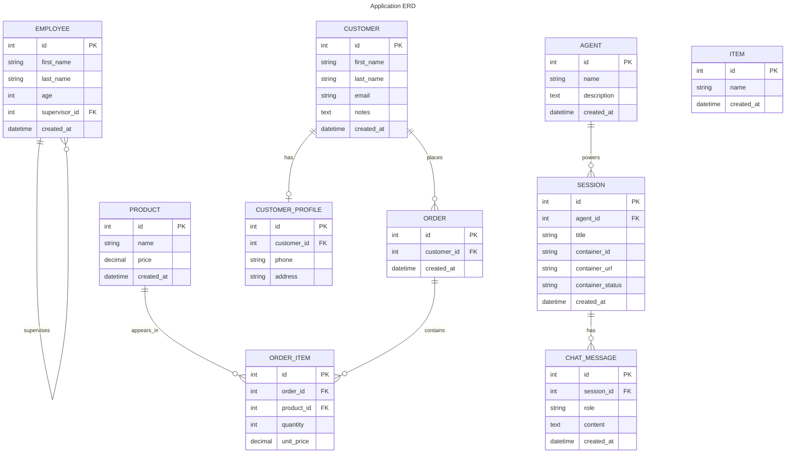

This is the entity relationship diagram for the project.

```mermaid
---
title: Application ERD
---
erDiagram
    EMPLOYEE ||--o{ EMPLOYEE : supervises
    CUSTOMER ||--o| CUSTOMER_PROFILE : has
    CUSTOMER ||--o{ ORDER : places
    ORDER ||--o{ ORDER_ITEM : contains
    PRODUCT ||--o{ ORDER_ITEM : appears_in
    AGENT ||--o{ SESSION : powers
    SESSION ||--o{ CHAT_MESSAGE : has

    ITEM {
        int id PK
        string name
        datetime created_at
    }

    EMPLOYEE {
        int id PK
        string first_name
        string last_name
        int age
        int supervisor_id FK
        datetime created_at
    }

    CUSTOMER {
        int id PK
        string first_name
        string last_name
        string email
        text notes
        datetime created_at
    }

    CUSTOMER_PROFILE {
        int id PK
        int customer_id FK
        string phone
        string address
    }

    PRODUCT {
        int id PK
        string name
        decimal price
        datetime created_at
    }

    ORDER {
        int id PK
        int customer_id FK
        datetime created_at
    }

    ORDER_ITEM {
        int id PK
        int order_id FK
        int product_id FK
        int quantity
        decimal unit_price
    }

    AGENT {
        int id PK
        string name
        text description
        datetime created_at
    }

    SESSION {
        int id PK
        int agent_id FK
        string title
        string container_id
        string container_url
        string container_status
        datetime created_at
    }

    CHAT_MESSAGE {
        int id PK
        int session_id FK
        string role
        text content
        datetime created_at
    }
```
